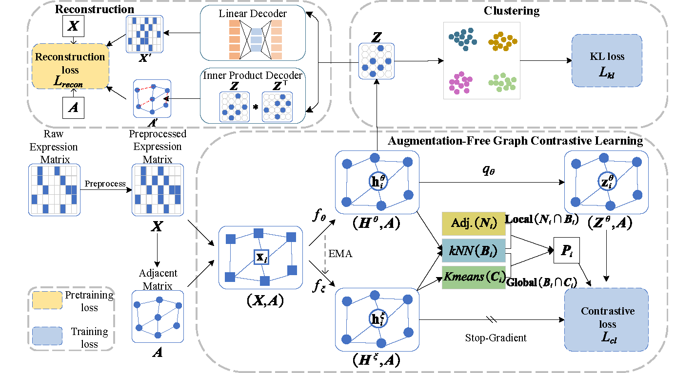

# scAFGCC: An Augmentation-Free Graph Contrastive Clustering Method for scRNA-Seq Data Analysis



## Introduction

In this study, we propose scAFGCC, a novel augmentation-free graph contrastive clustering method that combines graph convolutional network (GCN) and contrastive learning to exploit inter-cell relationships. scAFGCC does not require data augmentations and negative samples to learn graph representations. Instead, we generate positive samples by exploring the local structural information and the global semantics of the target nodes. We integrate feature representation learning with clustering tasks. Additionally, we introduce a reconstruction module that pretrains the model, facilitating faster training and improved performance.

## Installation

The package can be installed by `git`. The testing setup involves a Windows operating system with 16GB of RAM, powered by an NVIDIA GeForce GTX 1050 Ti GPU and an Intel(R) Core(TM) i7-7700HQ CPU @ 2.80GHz, running at a clock speed of 2.80 GHz.

### 1. Git clone from github

```
git clone https://github.com/tswstart/scAFGCC.git
cd ./scGCC/
```

### 2. Utilize a virtual environment using Anaconda

You can set up the primary environment for scGCC by using the following command:

```
conda env create -f environment.yml
conda activate scAFGCC
```

## Running scGCC

### 1. Data Preprocessing

For those who require swift data preparation, we offer a convenient Python script named preprocess_data.py located within the preprocess directory. This script, built on the foundation of Scanpy, streamlines the process of format transformation and preprocessing. It supports three types of input file formats: **H5AD, H5, and CSV data**. Throughout the preprocessing procedure, there are a total of five operations, encompassing cell-gene filtering, normalization, logarithmic transformation, scaling, and the selection of highly variable genes.

```python
# H5AD files
python preprocess/preprocess_data.py --input_h5ad_path=Path_to_input --save_h5ad_dir=Path_to_save --filter --norm --log --scale --select_hvg
# H5 files
python preprocess/preprocess_data.py --input_h5_path=Path_to_input --save_h5ad_dir=Path_to_save --filter --norm --log --scale --select_hvg
# CSV files
python preprocess/preprocess_data.py --count_csv_path=Path_to_input --label_csv_path=Path_to_input --save_h5ad_dir=Path_to_save --filter --norm --log --scale --select_hvg
```

### 2. Apply scAFGCC

By utilizing the preprocessed input data, you have the option to invoke the subsequent script for executing the scAFGCC method:

```python
# balanced datasets
python main.py --dataset dataset/balanced_data/data0c4_preprocessed.h5ad --mbedder scAFGCC-Results --layers [512] --pred_hid 1024 --lr 0.001 --topk 3 --device 0
# imbalanced datasets
python main.py --dataset dataset/imbalanced_data/data-1c4_preprocessed.h5ad --mbedder scAFGCC-Results --layers [512] --pred_hid 1024 --lr 0.001 --topk 3 --device 0
# real datasets
python main.py --dataset dataset/real_data/Human1_preprocessed.h5ad --mbedder scAFGCC-Results --layers [512] --pred_hid 1024 --lr 0.001 --topk 3 --device 0
```

In this context, we offer a collection of commonly employed scAFGCC parameters for your reference. For additional details, you can execute `python scAFGCC.py -h`.

**Note**: output files are saved in ./results, including `Evaluation index(scAFGCC-Results.csv)` and `run log(scAFGCC-Results.txt)`.